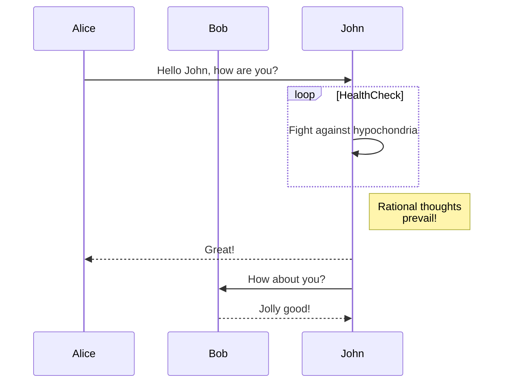
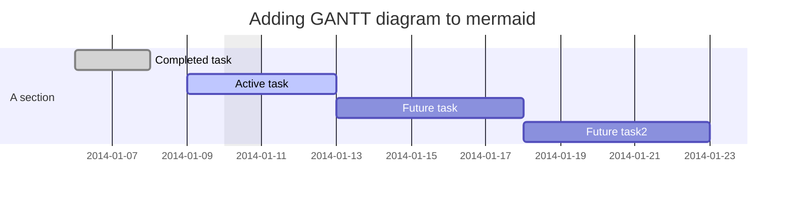

# 标题1

## 标题2

### 标题3

#### 标题4

##### 标题5

###### 标题6

**加粗**

_斜体_

~~删除~~

**粗体 _斜体_ 粗体**

**_斜体加粗体_**

> 引用
>
> > 嵌套引用

# 列表语法

## 有序列表

1. First item
2. Second item
3. Third item
   1. Indented item
   2. Indented item
4. Fourth item

## 无序列表

- First item
- Second item
- Third item
  - Indented item
  - Indented item
- Fourth item

## 在列表中嵌套其他元素

- This is the first list item.
- Here's the second list item.

  > A blockquote would look great below the second list item.

- And here's the third list item.

## Markdown 围栏代码块

### json

```json
{
  "firstName": "John",
  "lastName": "Smith",
  "age": 25
}
```

### c#

```csharp
using System;

namespace HelloWorldApp
{
    class Program
    {
        static void Main(string[] args)
        {
            Console.WriteLine("Hello, World!");
        }
    }
}
```

### vue

```vue
<script setup lang="ts">
import { Table } from 'ant-design-vue'
import { throttle } from 'es-toolkit'
import yaml from 'js-yaml'
import { defineProps, ref, watch } from 'vue'

const props = defineProps<{
  code?: string
}>()

const tableData = ref({
  columns: [],
  dataSource: [],
})

const handleYamlParse = throttle((code: string) => {
  if (!code) return
  try {
    const json = yaml.load(code) as typeof tableData.value
    if (Array.isArray(json.columns)) {
      tableData.value.columns = json.columns.filter((it: any) => {
        if (!it || !it.title || !it.key) return false

        return true
      })
    }

    if (Array.isArray(json.dataSource)) {
      tableData.value.dataSource = json.dataSource.filter(it => !!it)
    }
  }
  catch (error) {
    // console.log('>>', error)
  }
}, 50)

watch(() => props.code, (code, oldCode) => {
  handleYamlParse(code || '')
}, {
  immediate: true,
})
</script>

<template>
  <div>
    <Table
      :columns="tableData.columns"
      :dataSource="tableData.dataSource"
    />
  </div>
</template>

<style module="Css" lang="less">

</style>
```

## Markdown 分隔线语法

---

## Markdown 代码语法

At the command prompt, type `nano`.

``Use `code` in your Markdown file.``

## Markdown 链接语法

这是一个链接 [Markdown语法](https://markdown.com.cn)。

## Markdown 表格

| Syntax    | Description |
| --------- | ----------- |
| Header    | Title       |
| Paragraph | Text        |

## Markdown 任务列表语法

- [x] Write the **press** release
- [x] Update the _website_
- [ ] Contact the `media`

## 图表

### 流程图


### 时序图



## Alerts

> [!NOTE]
> Useful information that users should know, even when skimming content.

> [!TIP]
> Helpful advice for doing things better or more easily.

> [!IMPORTANT]
> Key information users need to know to achieve their goal.

> [!WARNING]
> Urgent info that needs immediate user attention to avoid problems.

> [!CAUTION]
> Advises about risks or negative outcomes of certain actions.

### 甘特图



## 公式math

Lift($$L$$) can be determined by Lift Coefficient ($$C_L$$) like the following
equation.

$$
L = \frac{1}{2} \rho v^2 S C_L
$$

## Footnote

A note[^1]

[^1]: Big note2.

[^1]: Big note3.

### 分割线

---

## 表情

去露营了！ :tent: 很快回来。

真好笑！ :joy:

## html

<p>markdown html内容<p>
