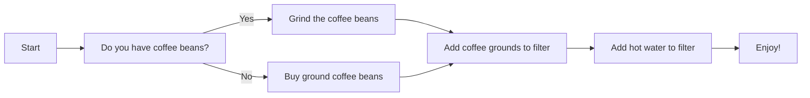

**粗体**<span style="color: red">1<a>x*斜体*x</a>2</span>

```javascript
console.log('It works!')
```

## mermaid



## 自定义echarts组件渲染

```x-echarts
{
  "xAxis": {
    "type": "category",
    "data": [
      "Mon",
      "Tue",
      "Wed",
      "Thu",
      "Fri",
      "Sat",
      "Sun"
    ]
  },
  "yAxis": {
    "type": "value"
  },
  "series": [
    {
      "data": [
        820,
        932,
        901,
        934,
        1290,
        1330,
        1320
      ],
      "type": "line",
      "smooth": true
    }
  ]
}
```
